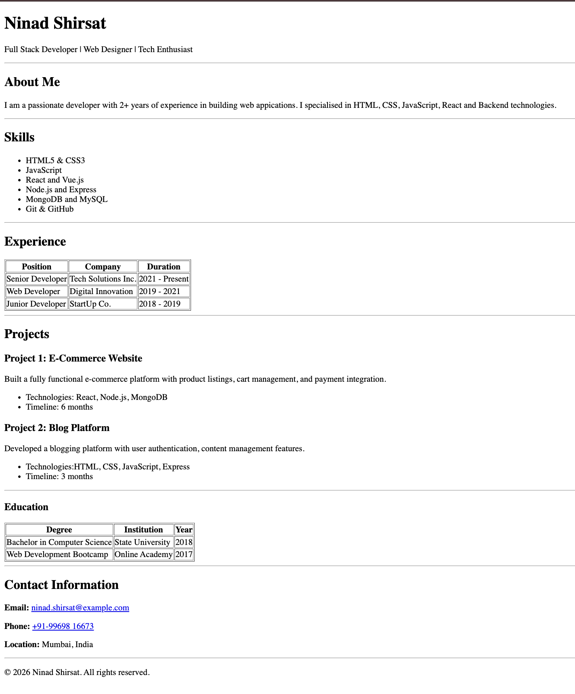

# HTML Resume Project

A single-page resume website built using **only HTML**, following the provided layout and assignment instructions.

## 🔗 Live Demo

https://html-resume-project-omega.vercel.app/

## 📸 Screenshot



## ⚙️ Setup Steps

1. Clone the repository:
   ```bash
   git clone https://github.com/Ninadshirsat/html-resume-project.git
   ```
2. Open the project folder.

3. Open index.html in any web browser.

## ▶️ Usage

View the resume as a single-page website.

No additional setup or dependencies are required.

## 🛠️ Tech Used

- HTML

## 👤 Author

**Ninad Shirsat**  
GitHub: https://github.com/Ninadshirsat  
LinkedIn: https://linkedin.com/in/ninad-shirsat-177656201/
Portfolio: https://ninad-shirsat-portfolio.vercel.app/
